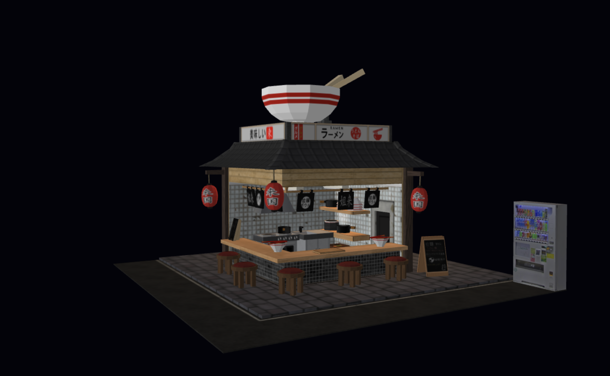

# Ichiraku Ramen - Progetto Computer Graphics

Ichiraku Ramen è un diorama interattivo tridimensionale che riproduce un tipico vicolo notturno giapponese, sviluppato in WebGL 2, GLSL e JavaScript. è possibile navigare nel vicolo, comprare una bevanda fresca o immergersi nell'atmosfera giapponese grazie alla possibilià di ascoltare musica tipica, il tutto accompagnato da un sottofondo di cucina giapponese reale.

## Screenshot della Scena

## Live Demo
Il progetto è pubblicato e consultabile in tempo reale al seguente 
[https://giordu.github.io/ichirakuRamen/]

